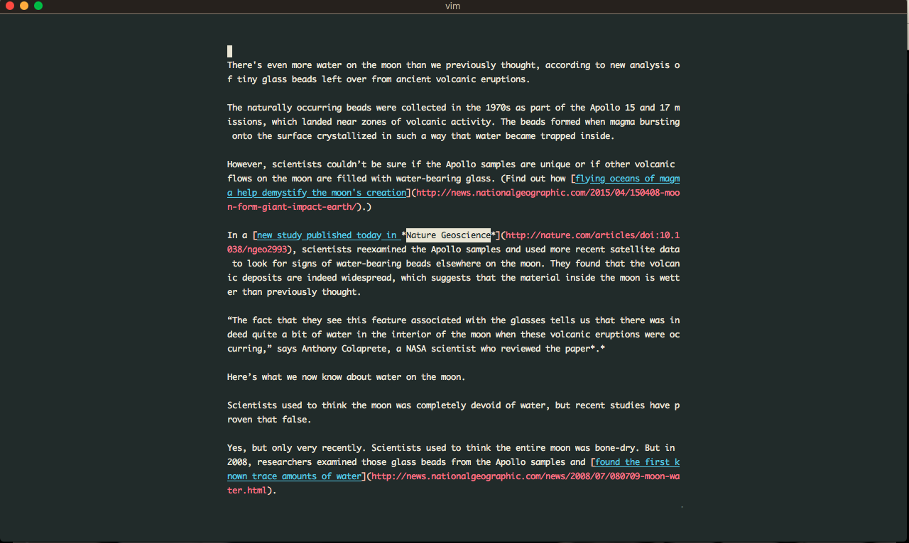

# microform

**microform** is a command-line utility for reading articles in the terminal. It uses [Mercury Web Parser](https://mercury.postlight.com/web-parser/) and [tomd](https://github.com/gaojiuli/tomd) (an HTML to Markdown converter) to fetch a web page and generate a readable, markdown version of its content. microform serves a purpose similar to other "reader" services, such as [Readability](https://en.wikipedia.org/wiki/Readability_(service)), Safari Reader, Firefox Reader View, Instapaper.

microform makes use of [requests-cache](https://github.com/reclosedev/requests-cache) to cache responses from Mercury Web Parser. The default database is a `mercury.sqlite` file. However, you can configure microform to use a DB name of your choice, by setting the `MERCURY_DB_NAME` environment variable.

**Note:** 
In general, I've found Mercury Web Parser to be very good, but there are some cases when it fails to correctly parse an article that other services (such as Firefox Reader View or Instapaper) parse correctly. If your article seems to start in the middle or seems truncated, this is likely why. I'm open to ideas on how to improve this and interested in allowing users to configure `microform` with their preferred parser. Pull requests addressing these issues are very welcome.

## Installation & Configuration

`pip install microform`

The only required environment variable that must be set is `MERCURY_API_KEY`, which should be set to the API key provided to you by Mercury Web Parser.

Other configuration options include:

- `MERCURY_DB_NAME`: name of the sqlite db where cached reponses from Mercury Web Parser are stored.
- `MICROFORM_PAGER`: The pager that will be launched to display your article

## Requirements

- Python 3
- requests
- requests-cache
- tomd

## Usage
`microform https://foo.com/barticle`

Before using, you must set the `MERCURY_API_KEY` to the API key provided to you by Mercury Web Parser.

### Pagers

microform defaults to printing your article to stdout. However, using a pager is much more enjoyable!

You can set microform to use your pager of choice by setting the `MICROFORM_PAGER` environment variable.

For example, `export MICROFORM_PAGER="less"` will allow you to read your article in `less`.

I'm particularly fond of using `vim` in read-only mode — in conjunction with the [Goyo](https://github.com/junegunn/goyo.vim) and [vim-markdown](https://github.com/plasticboy/vim-markdown) plugins — as my pager.

My current `MICROFORM_PAGER` env var is set to `view -c "Goyo 50%x10%%"`, which will launch your article in `Vim` in read-only mode and uses the Goyo plugin to format the width and height of the resulting text. Syntax highlighting is handled by `vim-markdown`.

## Screenshot

Here's an example of the output using the configuration described above. The example article is http://news.nationalgeographic.com/2017/07/water-moon-formed-volcanoes-glass-space-science/.

